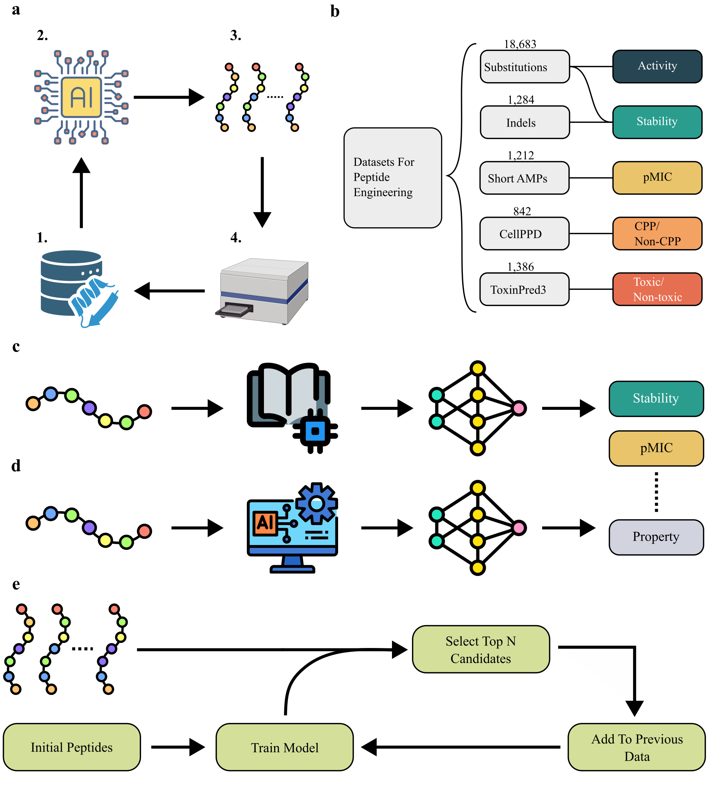

# SCARSE: Small-sample Classification And Regression Solution for low-resource peptide Engineering - Reproducability code
<p align="center">
  
</p>

## Abstract
Being able to predict peptide properties under low-data conditions is paramount for early-stage AI-guided peptide engineering. In this study, we introduce SCARSE, a machine learning approach leveraging ESM-2, gaussian process regressor, and extremely randomized trees classifier to model peptide properties at low-resource conditions, with training sizes ranging from 20 to 500 samples. We perform a comprehensive benchmark across 23 peptide and small-protein datasets, encompassing substitutions, indels, antimicrobial peptides, cell penetrating peptides, and toxic/non-toxic peptides. The protein language model approach outperforms baseline, while also achieving high predictive performance even at very low-data settings. We further evaluate SCARSE in simulated sequential active learning experiments that emulate iterative peptide discovery workflows, where model-guided selection consistently outperformed random sampling. Finally, we show that as few as 50 characterized peptides can be enough to estimate the end-point performance of workflow simulations, providing researchers with a procedure of verifying SCARSE suitability to their data. 

## Preperations
1. Create the following folder structure for the data:
```
project-root/
├── data/
    ├── cellppd/
    │   └── raw/
    │       ├── cellppd_negative.csv/
    │       └── cellppd_positive.csv/
    ├── mbc/
    │    └── raw/
    │       └──  EC.csv/
    ├── proteingym_dms/
    │    └── raw/
    │       ├── DMS_ProteinGym_indels/
    │       └── DMS_ProteinGym_substitutions/
    └── toxinpred3/
        └── raw/
           ├── train_neg.csv/
           └── train_pos.csv/
```
2. Download all required data and place the files in the raw folder for each dataset. 
    * Substitution and indel DMS assay datasets: https://proteingym.org/download
    * Short AMPs: https://journals.asm.org/doi/10.1128/msystems.00345-23
    * CellPPD: https://webs.iiitd.edu.in/raghava/cellppd/algo.php
    * ToxinPred3: https://webs.iiitd.edu.in/raghava/toxinpred3/ 
3. Set up environment using *requirements.txt*.
4. Go to */code/benchmark/process_data* and run *process_data.ipynb*.

* Before running all the code below, update all the paths in the .sh files so that the path to the datasets, environment and the output path are correct for your setup.
* Make sure you've downloaded ESM-2 650M from HuggingFace and specify the path to it in the .sh files. It will automatically be downloaded the first time one runs the scripts, but make sure to only run one job the first time, so that errors does not occur from multiple jobs trying to download the same model at the same time.

## Benchmark
1. Go to */code/benchmark/simulate_experiments/scripts* and run *sbatch* for each script.
2. Go to */code/benchmark/simulate_experiments* and run *run_aggregate.sh* and *run_aggragate_classification.sh* for each dataset (manually change the dataset name each time running the scripts).
3. Go to */code/benchmark/simulate_experiments/statistics* and run all notebooks.
4. Go to */code/benchmark/simulate_experiments* and run *visualizations_3.ipynb*.

## Active learning workflow simulations
1. Go to */code/workflow_simulation/scripts* and run *simulation_per_seed.sh* and *baseline_simulation_per_seed.sh*.
2. Go to */code/workflow_simulation* and run *simulation.ipynb*.

## Investigation into CV $R^2$ score correlation with end-point active learning simulation performance
1. Go to */code/selection_analysis* and run *benchmark_script.sh*.
2. Run *run_aggregate.sh*.
3. Run *selecting_workflow_eval.ipynb*.

